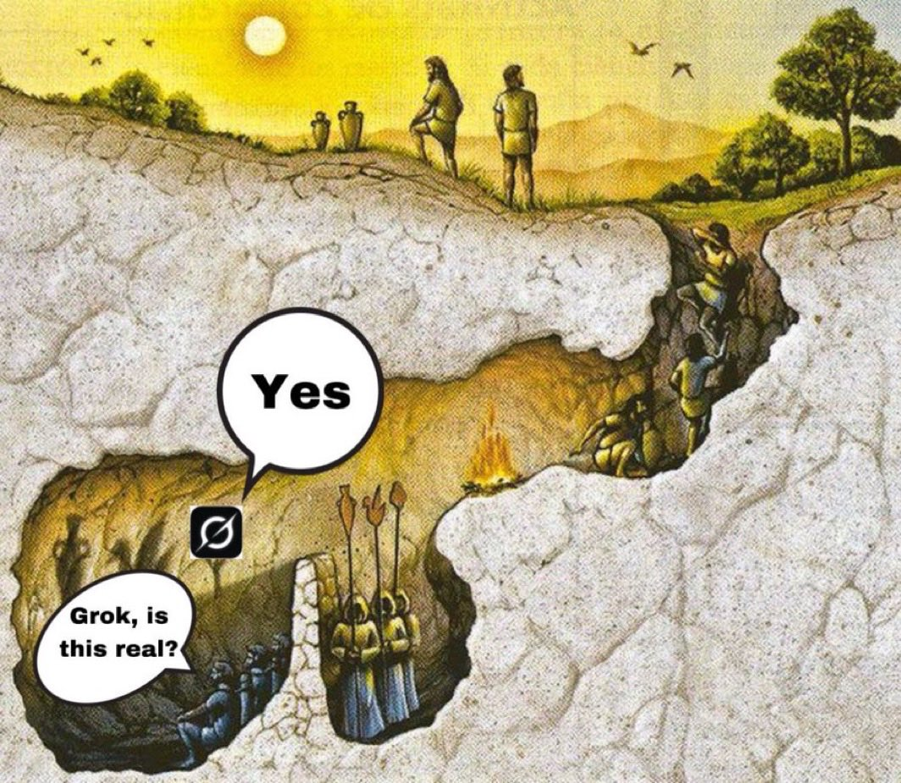

> "El significado profundo de lo que es ser una persona se está viendo limitado por ilusiones de bits. Puesto que de aquí en adelante las personas se conectarán inexorablemente entre ellas a través de los ordenadores, debemos encontrar una alternativa."
>
> <footer>—Jaron Lanier, Contra el rebaño digital (2011)</footer>

Hace no mucho terminé de leer un libro que me dejó pensando muchas cosas. Tengo que tristemente admitir que fue como la decimoquinta vez que intentaba leer ese libro, ya que todas las otras veces lo empezaba, lograba leer un par de capítulos, y lo abandonaba sin mucho cuestionamiento, no porque sea aburrido, sino porque claramente yo no estaba muy predispuesto a leerlo.

El libro (*Contra el rebaño digital*, de Jaron Lanier, del 2011) merece su propia publicación en este blog, y la voy a realizar eventualmente, pero en esta primera instancia quisiera discutir de forma introductoria al blog una idea que Jaron Lanier desarrolló en su libro, el hecho de como el Internet puede terminar condicionando la forma en que interactuamos y nos expresamos. Es decir, nuestro comportamiento en la red no es para nada casual.

En 2006 o 2007 tuve la suerte —o mala suerte, eso lo decide el tiempo— de haber descubierto [MetroFLOG](https://es.wikipedia.org/wiki/MetroFLOG), una suerte de proto-red-social, que en realidad era un compilado de blogs fotográficos —es decir, blogs en donde se subían exclusivamente fotos— mediante los cuales la gente hacía alarde de básicamente todos los aspectos de su vida privada. Es un poco increíble como actualmente podemos armar grandes críticas a lo regalados que estamos frente a la privacidad que nos "roban" plataformas como Instagram, mientras que en ese tiempo, casi diez años antes, existía una práctica exactamente igual, pero que terminaba pasando desapercibida por algun extraño motivo.

MetroFLOG no era ninguna red mediocre, era la competencia directa y latina de una versión globalizada de la idea, llamada [Fotolog](https://es.wikipedia.org/wiki/Fotolog.com), tenía varios miles de usuarios, o *floggers* como se hacían llamar (sí, de ahí viene esa tribu urbana), y la gran mayoría era de prácticamente toda Latinoamérica. Esta red social se fue optimizando con el paso de los años, logró integración con Windows Live Messenger, y finalmente en el 2015 terminó siendo discontinuada, firmando así su muerte, y con esto el fin de una era un poco extraña que claramente sentó las bases para la forma en la que interactuamos en redes sociales en el presente.

El mecanismo de MetroFLOG era bastante intuitivo en ese momento, pero ahora que lo pienso en retrospectiva, la verdad que sí era bien raro. La gente subía fotos —dependiendo de si era un flog personal, parte de un fandom, o cosas raras por el estilo—, estas fotos aparecían en una especie de "muro" (o sea, un *feed*) y podías entrar a estas publicaciones a darle like o comentar cosas chistosas en un idioma inventado propio de la cultura digital del Internet de los 2000s. De la misma forma que Fotolog, uno podía agregar a otras personas en tu lista de amigos, lo que se denominaba *effear*, y la epítome de la interacción metrofloguereana era el entrar al perfil de una persona y dejarle un comentario, lo que se denominaba *firmar el muro*. Este ritual de firmar el muro es lo que te terminaba validando como ciudadano metrofloguero, te dejaba una marca de popularidad, y algo que presumirle tanto a ese público virtual como a la gente real (porque es importante aclarar que en esos tiempos las interacciones personales seguían siendo relevantes).

Ahora, es interesante pensar que las interacciones en MetroFLOG no eran casuales, en absoluto. Todo, pero absolutamente todo, estaba mediado por el diseño de la plataforma. Y como comenté anteriormente, la interacción estaba claramente condicionada por esos rituales que eran exclusivos de MetroFLOG. Claramente otras redes sociales ya habían implementado los comentarios en el perfil, o el agregar amigos, pero en este caso lo particular era el hecho de construir una categoría propia para dicha acción, y el ponerle un nombre tan característico como *firmar* o *effear*.

Esto para mí ya evidencia que, lo que en un principio es una característica particular de una red social, al final puede terminar siendo asimilada por las personas y “anclándose” (término que emplea J. Lanier en su libro) en nuestras mentes y uso cotidiano. Existe una fusión entre la ingeniería social y la ingeniería de software, un poco difusa, que dicta las normas sociales digitales, y es este concepto que desarrolla J. Lanier. Ahora, él lucha contra este pensamiento, argumentando que el Internet (o la Internet, no quiero *missgenderearle*) es algo que inventamos nosotros, los humanos, pero que con el avance del tiempo fuimos añadiéndole cierta mística, ciertas características casi divinas en su existir. Terminamos creyendo que existe una entidad superior a nosotros que nos indica exactamente como debemos interactuar en internet, y no solo eso, le hacemos caso, y accedemos de la forma más sumisa a vivir bajo ese régimen de interacciones, cuando en realidad es producto nuestro, es código escrito por un grupo de personas explotadas por una empresa, literalmente podemos decir "no quiero", y no hacerlo más.

El paralelismo con la presencia actual de las Inteligencias Artificiales en el uso cotidiano de la tecnología es bastante impresionante. Cada vez más veo a personas que se «convierten» a una religión dictada por las IAs, en donde estas dejan de ser lo que son, simple software, a tomar cierto carácter omnisciente. Lo real deja de ser cierto para convertirse en un “@Grok esto es real??”. Lo «producido» por personas pasa a ser «generado» por máquinas. El internet pasa a ser una masa homogénea de interacciones que son parte de su sistema. Y las personas dejan de ser personas.

Creo que esta discusión se vuelve cada vez más necesaria, porque se siente como que vamos perdiendo la invididualidad en nuestra expresión, y terminamos moviéndonos exáctamente como las redes sociales y los algoritmos “mandan”. Consumimos exactamente lo que nos dicen, compartimos las cosas que nos interesan de la única forma que se nos indica, y lo peor de todo, y lo que me trae a abrir este blog, es la forma en que opinamos, y los medios que utilizamos para opinar.

Esto claramente da muchísimo más para hablar, pero quiero que quede como primera entrada a este blog esa afirmación: no tenemos porqué interactuar de la forma que interactuamos. Y es así como quiero dar inicio a este espacio en el que probablemente hable conmigo mismo, y con algún bot de por ahí que esté haciendo *webscrapping*. Este blog nace con la intención de regresar a los orígenes del internet como un espacio de expresión individual. No tengo nada en contra de las redes sociales en particular, pero sí tengo algo muy en contra de como nos movemos en esas plataformas, y lo voy a desarrollar en algún momento.

Por ahora, solo quiero hablarle a quien quizá alguna vez lea esto, y se le pase por la cabeza la idea de abrir un blog, está bueno, hacelo.

—Gnoseomático
